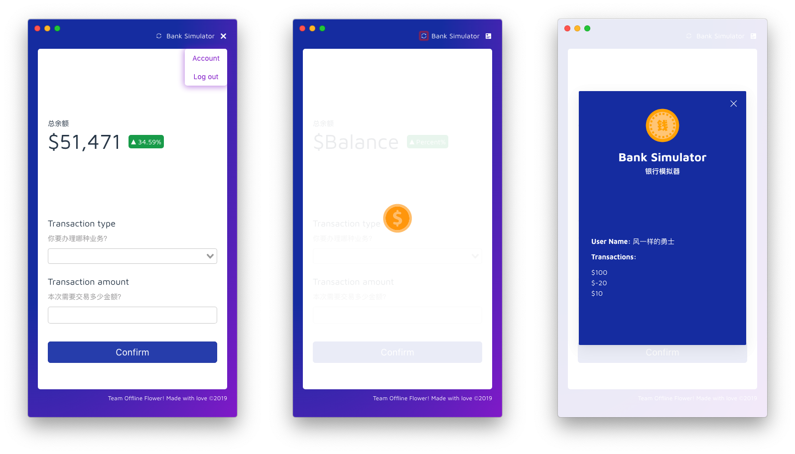

# Bank Simulation Client

> A bank simulation client

## Demo



## Build Setup

``` bash
# install dependencies
yarn install

# serve with hot reload at localhost:9080
yarn run dev

# build electron application for production
yarn run build

# lint all JS/Vue component files in `src/`
yarn run lint

```

## API Guidelines

For detailed documentation, see: [Notion - Bank Simulator](https://www.notion.so/spencerwoo/Bank-Simulator-e2fb5d22a6d044828c730cf1e363c224).

---

💰 Bank Simulator ©Spencer Woo. Released under the MIT License.

Authored by Spencer Woo. Maintained by Team Offline Flower. 🌼

[@Blog](https://spencerwoo.com/) - [ⒿJike](https://web.okjike.com/user/4DDA0425-FB41-4188-89E4-952CA15E3C5E/post) - [@GitHub](https://github.com/spencerwooo)